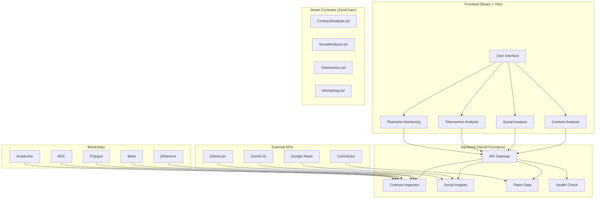
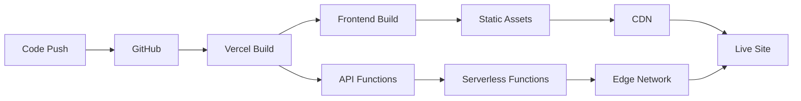
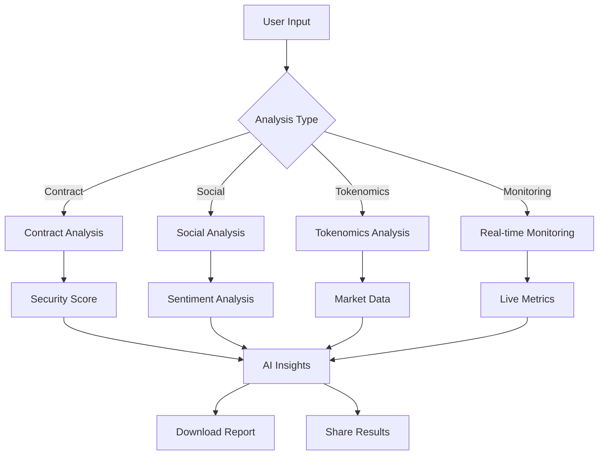

# 🛡️ ZetaGuardian

<div align="center">
  
  
  <video width="600" height="400" controls>
    <source src="https://raw.githubusercontent.com/ombaviskar18/ZetaGaurdian/main/hello/public/heroivideo.mp4" type="video/mp4">
    Your browser does not support the video tag.
  </video>
  
  **DeFi Security & Analysis Platform**
  
  *Real-time contract analysis, social sentiment tracking, and automated monitoring for DeFi investors*
  
  [](https://zetachain.com)
  [](https://reactjs.org)
  [](https://vercel.com)
  [](LICENSE)
</div>

## 🚀 Features

| Feature | Description |
|---------|-------------|
| 🔍 **Contract Analysis** | Smart contract security audit, risk assessment, ABI analysis with AI insights |
| 📊 **Social Analysis** | Real-time news integration, sentiment analysis, SWOT analysis, Telegram bot alerts |
| 📈 **Tokenomics Analysis** | Market data, supply analysis, whale tracking, portfolio analysis |
| ⚡ **Real-time Monitoring** | Live token tracking, price alerts, AI predictions, interactive charts |
| 🎨 **Modern UI/UX** | Responsive design, print reports, mobile optimized, real-time updates |

## 🏗️ Architecture



## 🛠️ Tech Stack

| Layer | Technology |
|-------|------------|
| **Frontend** | React 19, TypeScript, Vite, Framer Motion, Chart.js |
| **Backend** | Node.js, Express.js, Vercel Functions, Axios |
| **Blockchain** | ZetaChain, Solidity, Hardhat, Ethers.js |
| **APIs** | Google News, CoinGecko, Gemini AI, Telegram Bot |
| **Deployment** | Vercel, GitHub Actions |

## 🚀 Quick Start

### **Prerequisites**
- Node.js 18+
- MetaMask wallet
- API keys (see [Setup Guide](VERCEL_ENV_SETUP.md))

### **Installation**
```bash
# Clone & install
git clone <repository-url>
cd hello
npm install
cd frontend && npm install
cd ../api && npm install

# Start development
npm run dev --prefix frontend  # Frontend
npm run server                 # Backend
```

### **Live Demo**
🌐 **[https://zeta-gaurdian.vercel.app](https://zeta-gaurdian.vercel.app)**

## 🌐 Deployment

### **Vercel Deployment**
```bash
# Deploy to production
vercel --prod

# Deploy to preview
vercel
```

### **Environment Setup**
⚠️ **Required**: Configure environment variables in Vercel dashboard
- See [Setup Guide](VERCEL_ENV_SETUP.md) for detailed instructions
- Run `node test-api.js` to verify API functionality

### **Deployment Workflow**



### **Smart Contracts**
```bash
npx hardhat compile
npx hardhat deploy --network zeta
```

## 📱 Usage

### **User Workflow**



### **Quick Actions**
- 🔍 **Contract Analysis**: Enter address → Get security score
- 📊 **Social Analysis**: Enter symbol → View sentiment & news
- 📈 **Tokenomics**: Enter token → Analyze supply & metrics
- ⚡ **Monitoring**: Enter token → Track live data

## 🔧 Configuration

### **API Keys Required**
| Service | Setup Link | Purpose |
|---------|------------|---------|
| **Google News** | [Cloud Console](https://console.cloud.google.com) | News aggregation |
| **CoinGecko** | [CoinGecko API](https://www.coingecko.com/en/api) | Market data |
| **Gemini AI** | [AI Studio](https://makersuite.google.com/app/apikey) | AI insights |
| **Telegram Bot** | [@BotFather](https://t.me/botfather) | Automated alerts |

### **API Endpoints**
- `GET /api/health` - Health check
- `GET /api/inspect` - Contract analysis
- `GET /api/social/insights` - Social analysis
- `GET /api/token/total-supply` - Token data

## 🔒 Security & Benefits

### **Security Features**
- 🔍 Smart contract auditing & vulnerability detection
- 📊 Comprehensive risk scoring & assessment
- ⚡ Real-time monitoring & threat detection
- 🤖 AI-powered security insights
- 🌐 Multi-chain security analysis

### **Key Benefits**
| User Type | Benefits |
|-----------|----------|
| **Investors** | Risk assessment, portfolio monitoring, market insights |
| **Developers** | Contract auditing, cross-chain analysis, API access |
| **Analysts** | Comprehensive data, AI insights, report generation |

## 🤝 Contributing

1. Fork the repository
2. Create feature branch (`git checkout -b feature/amazing-feature`)
3. Commit changes (`git commit -m 'Add amazing feature'`)
4. Push to branch (`git push origin feature/amazing-feature`)
5. Open Pull Request

## 📄 License

This project is licensed under the MIT License - see the [LICENSE](LICENSE) file for details.

## 🆘 Support

- 📚 **Documentation**: Check code comments and inline docs
- 🐛 **Issues**: Report bugs via [GitHub Issues](https://github.com/your-repo/issues)
- 💬 **Discussions**: Join community discussions
- 📱 **Telegram**: [@Social_Alertbot](https://t.me/Social_Alertbot)

## 🚀 Roadmap

- [ ] Advanced AI Models & Enhanced predictions
- [ ] Additional blockchain support
- [ ] Native mobile application
- [ ] API marketplace & third-party integrations
- [ ] Enterprise-grade institutional features
- [ ] Direct DeFi protocol analysis

---

<div align="center">
  **Built with ❤️ on ZetaChain**
  
  *ZetaGuardian - Your DeFi Security Companion*
  
  [](https://github.com/your-repo/zetaguardian)
  [](https://github.com/your-repo/zetaguardian)
  [](https://github.com/your-repo/zetaguardian/issues)
</div>