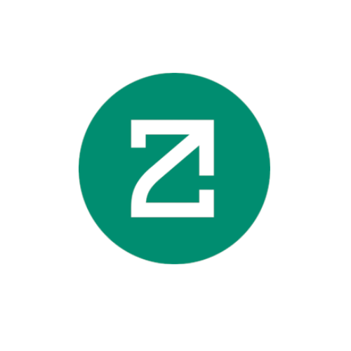

# 🛡️ ZetaGuardian - Decentralized Cross-Chain Security Agent

<div align="center">
  
  
  <h3>Your decentralized security deserves a beautiful home</h3>
  
  [](https://zetachain.com)
  [](LICENSE)
  [](https://reactjs.org)
  [](https://typescriptlang.org)
</div>

## 🎯 Vision

**"To become the decentralized cross-chain trust layer where every investor, wallet, and DEX has real-time scam protection, powered by ZetaChain's Universal Smart Contracts and Google Gemini AI intelligence."**

## ✨ Key Features

### 🛡️ 1. Cross-Chain Smart Contract Risk Analysis
- **ZetaChain Integration**: Universal Smart Contracts fetch contract data across Ethereum, BNB Chain, Polygon, Avalanche, etc.
- **Security Checks**: Owner privileges, hidden backdoors, honeypot & rugpull functions, liquidity lock/unlock status
- **AI Layer**: Gemini interprets bytecode summaries → outputs risk score + human-readable explanation

### 📊 2. Cross-Chain Tokenomics Evaluation
- **Multi-Chain Analysis**: Pull token distribution + balances from multiple chains in one transaction
- **Risk Assessment**: Whale concentration index, unlimited minting rights, suspicious tax structures
- **AI Intelligence**: Gemini evaluates tokenomics against known "scam playbooks"

### 🌐 3. Social & Community Forensics
- **Data Sources**: Twitter/X API, Telegram groups, Discord servers, Google Cloud BigQuery pipelines
- **Pattern Detection**: Fake follower spikes, bot-driven engagement, anon teams vs verified founders
- **Sentiment Analysis**: Gemini-powered fraud potential scoring

### ⚡ 4. Real-Time Protection & Alerts
- **Instant Analysis**: User scans token → ZetaChain queries → AI processes → Risk dashboard
- **Bot Integration**: Telegram/Discord alerts with pre-transaction warnings
- **Community Protection**: Scam leaderboards and threat intelligence sharing

## 🏗️ Architecture

```
┌─────────────────────────────────────────────────────────────┐
│                    Frontend (React + Vite)                  │
│  ┌─────────────────┐ ┌─────────────────┐ ┌─────────────────┐ │
│  │  Contract       │ │   Tokenomics    │ │    Social       │ │
│  │  Analysis       │ │   Evaluation    │ │   Forensics     │ │
│  └─────────────────┘ └─────────────────┘ └─────────────────┘ │
└─────────────────────────────────────────────────────────────┘
                                │
                                ▼
┌─────────────────────────────────────────────────────────────┐
│              ZetaChain Universal Smart Contracts            │
│  ┌─────────────────────────────────────────────────────────┐ │
│  │           Cross-Chain Data Aggregation                  │ │
│  │  Ethereum • BNB • Polygon • Avalanche • Arbitrum      │ │
│  └─────────────────────────────────────────────────────────┘ │
└─────────────────────────────────────────────────────────────┘
                                │
                                ▼
┌─────────────────────────────────────────────────────────────┐
│                 AI Analysis Layer                           │
│  ┌─────────────────┐ ┌─────────────────┐ ┌─────────────────┐ │
│  │  Google Gemini  │ │   Risk Scoring  │ │   Pattern       │ │
│  │  AI Engine      │ │   Algorithm     │ │   Recognition   │ │
│  └─────────────────┘ └─────────────────┘ └─────────────────┘ │
└─────────────────────────────────────────────────────────────┘
```

## 🚀 Quick Start

### Prerequisites
- Node.js (v18 or later)
- Yarn or npm
- Git
- Foundry (for smart contracts)

### Installation

1. **Clone the repository**
   ```bash
   git clone https://github.com/ombaviskar18/ZetaGuardian.git
   cd ZetaGuardian/hello
   ```

2. **Install dependencies**
   ```bash
   yarn install
   # or
   npm install
   ```

3. **Install Foundry dependencies**
   ```bash
   forge soldeer update
   ```

4. **Start the development server**
   ```bash
   cd frontend
   npm run dev
   ```

5. **Access the application**
   ```
   http://localhost:5173
   ```

## 📁 Project Structure

```
hello/
├── contracts/                 # Smart contracts
│   └── Universal.sol         # ZetaChain Universal Contract
├── frontend/                 # React frontend application
│   ├── src/
│   │   ├── components/       # Reusable UI components
│   │   ├── pages/           # Application pages
│   │   ├── hooks/           # Custom React hooks
│   │   ├── context/         # React context providers
│   │   ├── utils/           # Utility functions
│   │   └── constants/       # Application constants
│   └── public/              # Static assets
├── commands/                # CLI commands
├── scripts/                 # Deployment scripts
├── test/                    # Smart contract tests
└── README.md               # This file
```

## 🔧 Smart Contract Deployment

### Testnet Deployment

1. **Compile contracts**
   ```bash
   npx hardhat compile
   ```

2. **Deploy to ZetaChain Athens Testnet**
   ```bash
   npx ts-node commands/index.ts deploy --network testnet
   ```

3. **Cross-chain testing**
   ```bash
   npx zetachain evm call \
     --chain-id 84532 \
     --receiver $UNIVERSAL_CONTRACT \
     --private-key $PRIVATE_KEY \
     --types string \
     --values "hello"
   ```

## 🎨 Features Overview

### 🏠 Homepage
- Hero section with animated background
- Feature cards with hover effects
- Statistics and workflow sections
- Professional footer with social links

### 🔍 Contract Analysis
- Smart contract address input with validation
- Comprehensive security scanning
- Risk score visualization with circular progress
- Detailed vulnerability reports
- Downloadable analysis reports

### 📈 Tokenomics Evaluation
- Multi-chain token analysis
- Whale concentration metrics
- Tax structure evaluation
- Minting rights assessment

### 👥 Social Forensics
- Community sentiment analysis
- Bot detection algorithms
- Founder verification
- Social media pattern recognition

### 🚨 Real-time Monitoring
- Live threat detection
- Alert system integration
- Community reporting
- Threat intelligence sharing

## 🛠️ Technology Stack

### Frontend
- **React 18+** - Modern UI library
- **TypeScript** - Type-safe JavaScript
- **Vite** - Fast build tool
- **Framer Motion** - Smooth animations
- **Lucide React** - Beautiful icons
- **CSS3** - Modern styling with gradients and effects

### Blockchain
- **ZetaChain** - Universal smart contracts
- **Solidity** - Smart contract language
- **Foundry** - Development framework
- **Hardhat** - Ethereum development environment

### AI & Analytics
- **Google Gemini** - AI analysis engine
- **Pattern Recognition** - Custom algorithms
- **Risk Scoring** - Proprietary models

## 🔐 Security Features

### Risk Scoring Algorithm
```
Weighted Model:
├── Smart Contract Security → 40%
├── Tokenomics Analysis    → 30%
├── Social Signals         → 20%
└── Liquidity/Trading      → 10%

Risk Levels:
├── 🟢 Low (0-30)      → Safe
├── 🟡 Medium (31-60)  → Caution
├── 🟠 High (61-80)    → Likely Scam
└── 🔴 Critical (81-100) → Rugpull Imminent
```

## 🤝 Contributing

We welcome contributions! Please see our [Contributing Guidelines](CONTRIBUTING.md) for details.

1. Fork the repository
2. Create your feature branch (`git checkout -b feature/amazing-feature`)
3. Commit your changes (`git commit -m 'Add amazing feature'`)
4. Push to the branch (`git push origin feature/amazing-feature`)
5. Open a Pull Request

## 📄 License

This project is licensed under the MIT License - see the [LICENSE](LICENSE) file for details.

## 🌟 Acknowledgments

- **ZetaChain Team** for the Universal Smart Contract platform
- **Google** for Gemini AI integration
- **React Community** for the amazing ecosystem
- **DeFi Community** for inspiration and feedback

## 📞 Contact

- **GitHub**: [@ombaviskar18](https://github.com/ombaviskar18)
- **LinkedIn**: [Om Baviskar](https://www.linkedin.com/in/om-baviskar-/)
- **Project**: [ZetaGuardian](https://github.com/ombaviskar18/ZetaGuardian)

## 🚀 Roadmap

- [ ] **Phase 1**: Core security analysis features
- [ ] **Phase 2**: AI integration with Gemini
- [ ] **Phase 3**: Multi-chain expansion
- [ ] **Phase 4**: Mobile application
- [ ] **Phase 5**: Community governance
- [ ] **Phase 6**: Enterprise solutions

---

<div align="center">
  <p><strong>Built with ❤️ for DeFi security</strong></p>
  <p>Powered by ZetaChain Universal Smart Contracts</p>
</div>