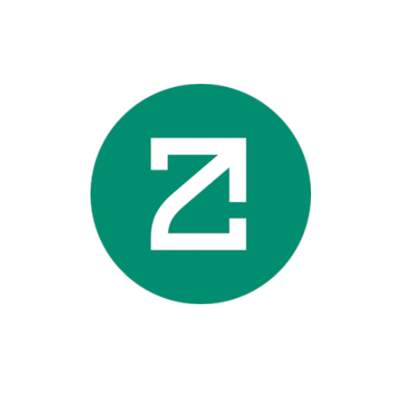

# 🎨 ZetaGuardian Frontend

<div align="center">
  
  
  <h3>Modern React Frontend for Decentralized Security</h3>
  
  [](https://reactjs.org)
  [](https://typescriptlang.org)
  [](https://vitejs.dev)
</div>

## 🚀 Quick Start

### Installation
```bash
npm install
npm run dev
```

### Access Application
```
http://localhost:5173
```

## 📁 Project Structure

```
frontend/
├── public/
│   ├── logos/              # Brand assets (logo.png, herovideo.mp4)
│   └── fonts/              # Custom fonts
├── src/
│   ├── components/         # UI components (Header, Button, Modal)
│   ├── pages/              # Application pages
│   │   ├── HomePage.tsx
│   │   ├── ContractAnalysisPage.tsx
│   │   ├── TokenomicsPage.tsx
│   │   ├── SocialAnalysisPage.tsx
│   │   ├── MonitoringPage.tsx
│   │   └── SendMessagePage.tsx
│   ├── hooks/              # Custom React hooks
│   ├── context/            # React context providers
│   ├── utils/              # Utility functions
│   ├── constants/          # App constants
│   └── types/              # TypeScript definitions
├── App.tsx                 # Main app component
└── main.tsx               # Entry point
```

## 🎨 Features

### 🏠 Homepage
- Hero section with animated background
- Feature cards with hover effects
- Statistics and workflow sections
- Professional footer

### 🔍 Contract Analysis
- Smart contract security scanning
- Risk score visualization
- Detailed vulnerability reports
- Downloadable analysis reports

### 📈 Additional Pages
- **Tokenomics**: Multi-chain token analysis
- **Social Forensics**: Community sentiment analysis
- **Monitoring**: Real-time threat detection
- **Send Message**: Cross-chain messaging

## 🎭 Design System

### Colors
```css
--primary: #00d4ff;        /* Bright cyan */
--secondary: #0077b6;      /* Deep blue */
--background: linear-gradient(to bottom, #0f172a, #1e293b, #0f172a);
```

### Components
- Glass morphism effects
- Gradient text animations
- Smooth hover transitions
- Responsive grid layouts

## 🔗 Technology Stack

- **React 18+** - UI library
- **TypeScript** - Type safety
- **Vite** - Build tool
- **Framer Motion** - Animations
- **React Router** - Navigation
- **Lucide React** - Icons

## 🌐 Web3 Integration

- Wallet connection (MetaMask, WalletConnect)
- Multi-chain support
- Transaction handling
- Chain switching

## 📱 Responsive Design

- Mobile-first approach
- Tablet and desktop optimized
- Flexible grid systems
- Touch-friendly interactions

## 🚀 Build Commands

```bash
# Development
npm run dev

# Production build
npm run build

# Preview build
npm run preview

# Type checking
npm run type-check

# Linting
npm run lint
```

## 🤝 Contributing

1. Fork the repository
2. Create feature branch: `git checkout -b feature/amazing-feature`
3. Commit changes: `git commit -m 'Add amazing feature'`
4. Push to branch: `git push origin feature/amazing-feature`
5. Submit pull request

## 📄 License

MIT License - see [LICENSE](../LICENSE) file for details.

---

<div align="center">
  <p><strong>Built with ❤️ using React + TypeScript + Vite</strong></p>
  <p>Part of the ZetaGuardian Security Suite</p>
</div>